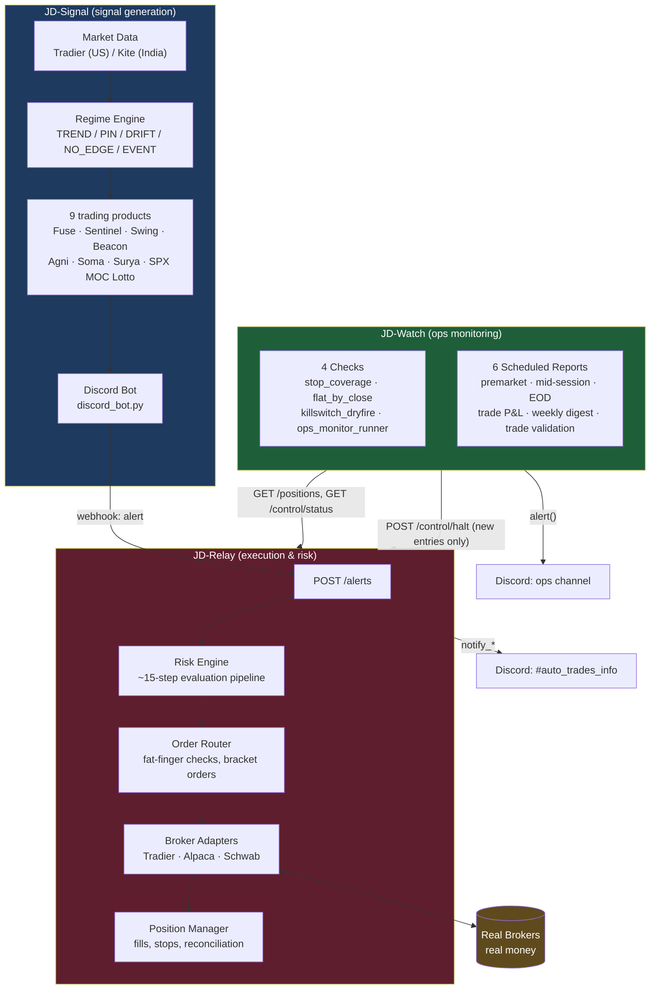

# JD Trading Platform — End-to-End System Documentation

**Last verified:** 2026-08-09, against `main`/`prod` HEAD of all three repos (JD-Signal, JD-Relay, JD-Watch), all branches confirmed in sync. Every claim in this document was checked directly against source code on this date, not recalled from memory — file:line references are included for anything you may be asked to prove live. (Originally published 2026-08-06; updated 2026-08-09 to cover two newly-shipped JD-Watch features — see [§5.4](#54-trade-performance-validation) and [§5.5](#55-bug-tracker).)

---

## Table of Contents

1. [Executive Summary](#1-executive-summary)
2. [System Architecture](#2-system-architecture)
3. [Component Deep Dive: JD-Signal](#3-component-deep-dive-jd-signal)
4. [Component Deep Dive: JD-Relay](#4-component-deep-dive-jd-relay)
5. [Component Deep Dive: JD-Watch](#5-component-deep-dive-jd-watch)
6. [End-to-End Trade Lifecycle](#6-end-to-end-trade-lifecycle)
7. [Risk & Safety Architecture](#7-risk--safety-architecture)
8. [Multi-Account / Multi-Broker Model](#8-multi-account--multi-broker-model)
9. [Reliability, Testing & Observability](#9-reliability-testing--observability)
10. [Current Operational Status](#10-current-operational-status)
11. [Known Limitations & Honest Gaps](#11-known-limitations--honest-gaps)
12. [FAQ — Anticipated Questions, Answered From Code](#12-faq--anticipated-questions-answered-from-code)
13. [Glossary](#13-glossary)
14. [Appendix: Tech Stack & Deployment](#14-appendix-tech-stack--deployment)

---

## 1. Executive Summary

The JD Trading Platform is a three-repo, fully automated options/equities trading system covering both **US** (NYSE/NASDAQ via Tradier, Alpaca, Schwab) and **India** (NSE/BSE via Zerodha Kite) markets. It is not one program — it is three independent, decoupled processes with a deliberate separation of concerns:

| Repo | Role | One-line summary |
|---|---|---|
| **JD-Signal** | Signal generation | Watches live market data (option chains, GEX/DEX, price/volume), classifies market regime, and decides *when a trade setup exists* — 9 distinct trading products plus 4 narrative/commentary products, across US and India. |
| **JD-Relay** | Execution & risk | Receives signal alerts over HTTP, independently re-validates every one against real-time broker data through a ~15-step risk pipeline, sizes the position, and — only if every gate passes — places the real order with a real broker, then manages its full lifecycle (fills, protective stops, exits, reconciliation). |
| **JD-Watch** | Ops monitoring | A third, independent process that watches JD-Relay and JD-Signal from the outside — the "who watches the watchmen" layer — catching failure modes neither of the other two can see about themselves (e.g., "is every open position's stop order still actually alive at the broker, right now"). Also now tracks whether real trading performance data is statistically trustworthy yet, and maintains a deliberate log of real bug fixes over time. |

**Why three separate processes, not one monolith:** each is designed to survive the others crashing. A crashed JD-Watch cannot stop JD-Relay from protecting open positions; a crashed JD-Signal cannot corrupt JD-Relay's already-placed orders; a hung JD-Relay broker call cannot block JD-Watch's kill-switch monitoring. This is a deliberate architectural choice, not an accident of how the codebases grew — see [§2](#2-system-architecture).

**Current live-money footprint:** 3 accounts trade real money today — Tradier `tradier_live`, Alpaca `alpaca_live`, and Schwab `schwab_live` — plus 2 paper/sandbox accounts (`tradier_sandbox`, `alpaca_sandbox`) for pre-production validation. See [§10](#10-current-operational-status) for their exact current state, pulled live for this document.

---

## 2. System Architecture

**The three processes never share a database, never import each other's code, and communicate only over well-defined boundaries:**

- JD-Signal → JD-Relay: one HTTP call, `POST /alerts`, authenticated with a shared secret (`X-JD-Relay-Secret` header, constant-time compared). JD-Signal has *no idea* whether a trade actually executes — it emits an alert and, for some products, waits for a structured accept/reject response; for others, it's genuinely fire-and-forget by design.
- JD-Watch → JD-Relay: plain HTTP GET/POST against JD-Relay's own operational API (`/positions`, `/control/status`, `/control/halt`, `/control/rearm`) — the exact same API a human operator would use, no special back-door.
- JD-Watch → JD-Signal: **not an API at all** — JD-Watch reads JD-Signal's SQLite database file directly, read-only (`mode=ro`), for two specific queries (latest regime, blocked-trade counts). This is the one place the "no coupling" rule is relaxed, and it's read-only and non-critical (a report field, not a safety mechanism).
- All three post independently to Discord — different channels, different bot tokens in most cases, so a webhook outage in one never silences the others.

This means: **JD-Relay is the only component with actual money-moving authority.** JD-Signal can only suggest; JD-Watch can only pause (never resume, never flatten a position on its own — see [§7](#7-risk--safety-architecture)).

---

## 3. Component Deep Dive: JD-Signal

**What it is:** a single long-running Python process (`discord_bot.py`, ~7,300 lines) for US products, running as `discord.Client` with ~20 background scheduled loops and 50+ Discord slash commands, plus four independent, smaller standalone scripts for India products, each its own systemd service.

### 3.1 The Product Catalog

JD-Signal generates signals for **9 distinct tradeable products** and **4 narrative-only commentary products** (no trade signal, informational Discord posts):

| Product | Market | Instrument | What it actually looks for |
|---|---|---|---|
| **Fuse** | US | 0DTE options (SPX/SPY/QQQ/IWM) | Three prioritized triggers: net-GEX sign flip, a call/put GEX-wall breach, or a **wall reclaim** (a failed breakout reversing back through the wall) — confirmed by momentum + option-volume confluence before firing |
| **Sentinel** | US | Multi-DTE options (3-21 days) | Structured directional setup with a 3-tier profit-taking ladder (40% / 40% / trailing runner) |
| **Swing** | US | Longer-dated options (10-90 days) | Same engine as Sentinel — literally the same signal class, different DTE/confidence tuning for a slower setup |
| **Beacon** | US | Stocks, long or short | Price vs. VWAP + trend alignment (SMA20/50) + volume spike + momentum — deliberately requires all three "legs" at HIGH confidence; never emits a medium/low-confidence signal |
| **SPX MOC Lotto** | US | 0DTE, far out-of-the-money SPX options | A small, cheap (≤$1.00) speculative bet near the close, on the side of a confident directional pressure reading — a proxy for closing-imbalance-driven moves, since no free real closing-imbalance data feed exists |
| **Agni** | India | Weekly NIFTY/SENSEX options | India's version of Fuse — OI-wall breach and wall-reclaim, adapted because Zerodha Kite has no options greeks (see [§11](#11-known-limitations--honest-gaps)) |
| **Soma** | India | Options, both near- and far-dated | Not a new engine — routes to the exact same Sentinel/Swing logic, just India-parametrized |
| **Surya** | India | Stocks (NSE) | India's Beacon — same engine, unmodified, against `.NS`-suffixed tickers |
| **Vayu** | India | Narrative only | India's commentary product, built on put/call OI skew instead of GEX (no GEX data available in India) |

Plus three more narrative/commentary products with **no trading signal at all** — pure market-read commentary posted to their own Discord channels: **Polarsis** (continuous bias/invalidation narrative), **Polaris Prediction** (once-daily premarket playbook), **Polaris Weekly Outlook** (weekly 5-tier support/resistance ladder). And one alert-only digest explicitly marked "no real trading": **Earnings Alert** (weekly upcoming-earnings digest with a directional lean).

### 3.2 The Regime Engine — the market-wide "should we even be trading" gate

Before any product-specific signal logic runs, JD-Signal classifies the *overall market regime* into one of five states, and every product's entry gate checks this classification first:

| Regime | Meaning | Trigger |
|---|---|---|
| **EVENT** | A scheduled macro event (FOMC/CPI/PPI/NFP/VIX expiry) is imminent | Locks entries until after the release, then re-classifies |
| **NO_EDGE** | No reliable read on direction | Core index (SPX/SPY/QQQ) net-GEX signs disagree, or structure is genuinely mixed |
| **TREND** | Negative gamma environment — moves tend to extend, not mean-revert | Net GEX negative, or spot below the "gamma flip" level with an air pocket beneath |
| **PIN** | Positive gamma near a strong open-interest concentration ("King Node") — moves tend to get pulled back | Net GEX positive and spot is close to that level |
| **DRIFT** | Positive gamma, but farther from the pin level — slower, less certain | Net GEX positive but distant from the King Node |

Each regime carries product-specific routing rules (`rules.yaml`) — e.g., in NO_EDGE, Fuse and Sentinel are fully locked out, but Beacon can still fire if its own confidence score clears an 85% override threshold.

**A real bug this system has already survived and fixed:** originally, *any* one of three tracked indices (SPX, SPY, QQQ core group, plus IWM as a secondary check) disagreeing on direction would force the whole market into NO_EDGE — including when the disagreeing ticker's actual GEX magnitude was negligible (e.g., IWM at −$65M vs. SPX's +$27.4B, a 400x difference) or the disagreement came only from the secondary ticker. Two separate fixes now exist: a magnitude floor so a tiny ticker's noise can't veto the whole market's regime, and IWM disagreement alone now costs a confidence penalty rather than an outright veto. This is a good, concrete illustration of the system's overall philosophy: **real production incidents get fixed at the architectural level, with a regression test, not patched around.**

### 3.3 Data Sources

- **US**: Tradier — real-time quotes, full option chains **with greeks** (delta, gamma). All of GEX/DEX/gamma-flip/wall computation is done **in-house** from these raw greeks — there is no third-party GEX dashboard/data provider involved.
- **India**: Zerodha Kite Connect — quotes and option chains, but **Kite returns no options greeks or IV at all**, confirmed structurally (not a bug — a genuine data-source limitation). This is why every India product uses simpler open-interest-based logic instead of GEX/DEX.
- **Stocks (both markets)**: intraday bars via yfinance for VWAP/moving-average/momentum/volume/ATR — the same client, unmodified, powers both Beacon (US) and Surya (India).

### 3.4 How an Alert Reaches JD-Relay

A single-purpose module (`jd_relay_webhook_emitter.py`) is the *only* place JD-Signal talks to JD-Relay — one JSON `POST` per alert, with a shared-secret header. Every alert carries a UUID `alert_id`, which JD-Relay uses to guarantee it never processes the same alert twice, even across restarts.

Two different reliability postures exist for different products, and this is a deliberate design choice, not an inconsistency:
- **Beacon and SPX MOC Lotto entries are not fire-and-forget** — the emitter waits for JD-Relay's real accept/reject response, and JD-Signal only opens its own local tracking if the trade was actually accepted somewhere. (This was itself a bug fix: previously, a rejected order still opened a "phantom" local trade.)
- **Everything else (stop updates, signal exits, Sentinel/Fuse entries) is genuinely fire-and-forget** — local narration/state proceeds regardless, because a delivery failure there is "a desync worth its own incident, not something that should unwind already-recorded local state."

### 3.5 Safety Net: Cooldowns and Shadow Tracking

Two separate mechanisms prevent noise and preserve evidence, without ever touching live trading decisions:

- **Candidate cooldown gate**: before any candidate can become a real alert, it passes through an ordered gate sequence (earnings blackout → cooldown → pending-duplicate → active-duplicate → confidence auto-approve), every step logged whether it passes or fails. This exists specifically because of a real, costly incident: a standalone India alert loop with *no* cooldown mechanism re-posted the same setup to Discord every ~5 minutes for hours, and real money was traded off some of those repeat posts. **Every new signal loop added since is now required to have a tested cooldown before going live for real money** — this is a written, standing rule for this codebase.
- **Shadow tracking**: every signal that gets *blocked* (by regime, cooldown, earnings blackout, duplicate check, etc.) is still simulated end-to-end — "what would have happened if we'd taken this?" — and recorded for later human review. This is deliberately evidence-only: nothing here ever auto-adjusts a live trading rule. The stated policy is to wait for 20-30+ closed shadow trades on a given gate before treating any pattern as more than a hint.

---

## 4. Component Deep Dive: JD-Relay

**What it is:** a FastAPI service plus two background async loops, running one fully independent, isolated "pipeline" per trading account — own broker connection, own circuit breaker, own database, own position tracking, own lock. Today there are 5 such pipelines: `tradier_sandbox`, `tradier_live` (both Tradier), `alpaca_sandbox`, `alpaca_live` (both Alpaca), `schwab_live` (Schwab).

### 4.1 The Risk Evaluation Pipeline

Every incoming alert is independently re-evaluated by **every enabled account**, against that account's own real-time broker data — not shared, not cached across accounts. The stock-trade pipeline runs roughly this sequence (options follow a parallel path with a few extra checks, e.g. a 0DTE-specific entry cutoff):

1. **Is this account currently halted?** (manual halt, or a daily/weekly circuit breaker already tripped)
2. **Is this ticker currently "degraded"?** (a known reconciliation mismatch against the broker — see [§4.3](#43-position-lifecycle))
3. **Is this product even routed to this account?** (an explicit allowlist per account — e.g. `schwab_live` only trades `spx_moc_lotto`)
4. **Is this product globally enabled?**
5. **Is the alert stale?** (too much time elapsed since it fired)
6. **Fetch a live quote — is it fresh, and has price moved too far from what the signal expected ("chased")?**
7. **Is this a duplicate alert, or does it conflict with an already-open position in the opposite direction, or duplicate one already open in the same direction?**
8. **Account compliance**: correct tier resolved for current equity, no active margin call, sufficient settled funds (cash accounts), not over the max concurrent positions cap for this tier, not over the sector concentration cap
9. **Market gates**: are we inside the trading window, is this ticker halted/limit-up-limit-down, is the spread too wide, is the quote internally crossed (bad data)?
10. **Position sizing**: risk-based sizing off the stop distance, clamped by exposure caps (per-ticker, intraday gross, overnight gross) and — if the position would be too large relative to the day's spread cost — rejected outright rather than sized down past a sane risk/reward
11. **Submit, if everything passed.**

There are **~25 distinct, named rejection reasons** this pipeline can return, and every single rejection is logged — most also notify Discord, with two reasons deliberately excluded because they're expected/non-actionable noise (see [§7.3](#73-notification-discipline)).

### 4.2 Circuit Breakers — the account-wide stop mechanism

Every account tracks its own independent daily and weekly P&L against a baseline, and halts new entries (never touches open positions) if:

- **Daily loss ≥ 3.0%** of the day's starting equity
- **Weekly drawdown ≥ 6.0%** from the week's starting equity
- **5 consecutive losing trades** in a row (daily halt)
- **3 consecutive losing trades** first triggers a *risk reduction* — position sizing is automatically cut in half until a win resets the streak

A halt only ever blocks *new* entries — it never force-closes anything already open. Clearing a halt (manual re-arm) is always a deliberate human action through a specific account, never a bulk "clear everything" — this is intentional: re-arming an account is treated as "I've personally verified this specific account is safe again," not a blanket gesture.

**Real incident this design already survived:** a shared circuit-breaker state file once compared a live account's real equity against a paper account's stale baseline after a mode switch, tripping a false 99.9% "weekly drawdown" halt. The fix — one fully separate breaker-state file per account — is now the standing pattern for every piece of per-account state in this codebase, and it's explicitly cited as the reason for several other design choices throughout the system.

Position sizing itself is **tiered by account equity**: 7 tiers from $200 up through $1,000,000+, each with its own risk-per-trade percentage (1.5% down to 0.5% as equity grows), maximum concurrent positions, and exposure caps — smaller accounts get proportionally tighter position limits and lower per-trade risk ceilings as a matter of policy, not because of a technical constraint.

### 4.3 Position Lifecycle

Once an order is accepted, JD-Relay tracks it through its full life: fill confirmation, protective stop/target order management, and continuous reconciliation against what the broker actually reports.

- **Bracket orders**: entry + stop + target submitted together as one linked order where the broker's API supports it (Tradier, and Alpaca for stocks); options on Alpaca can't use a native bracket at all, so the entry goes first and the protective stop/target follows as an explicit second order.
- **Scale-out**: larger positions are split into chunks (typically two, sometimes three), each with its own bracket, so partial profit-taking (moving the stop to breakeven after the first target hits) is possible without touching the remaining position.
- **Reconciliation**: every 30 seconds, each account's tracked positions are compared against what the broker actually reports. A mismatch that persists past a short grace period (45 seconds, to avoid false alarms from normal fill latency) marks that specific ticker "degraded" — new alerts for it are blocked until the mismatch clears or a human manually clears it — while the position itself, and its existing broker-side protective stop, stay completely untouched and protected regardless.
- **End-of-day flatten**: any position not specifically flagged as swing-eligible is automatically closed near the close (15:55 ET), with the fill confirmed via polling before it's ever recorded as closed — a deliberate choice after an earlier bug once fabricated dozens of phantom "closed" trades by trusting order-submission acceptance instead of an actual confirmed fill.

### 4.4 Broker Coverage

| Broker | Real-money status today | Integration |
|---|---|---|
| **Tradier** | Live (`tradier_live` account) | Plain REST API |
| **Alpaca** | Live (`alpaca_live` account) | Plain REST API |
| **Schwab** | Live (`schwab_live` account, one product only: SPX MOC Lotto) | REST via a community SDK, requires a one-time manual OAuth step |
| **Robinhood** | Not enabled — feature-flagged off | A fundamentally different protocol (MCP/JSON-RPC, not REST); the code itself documents its own tool names as unverified placeholders pending real validation, and there is **no sandbox/paper environment on Robinhood at all** — the very first real order this adapter would ever place is against real money with zero rehearsal |
| **IBKR** | Not implemented | A stub only — every method deliberately raises "not implemented" |

### 4.5 Notification Discipline

JD-Relay posts to Discord for fills, rejections, incidents, circuit-breaker events, and a consolidated per-alert summary showing what every account did with each incoming signal (grouped Live accounts / Sandbox accounts, so "did anything real happen today" is the first thing visible rather than something to compute by eye). Two layers keep this from becoming noise without hiding real problems:

- A small, fixed set of rejection reasons that are inherently non-actionable (a stale alert, a market-hours gate, a product simply not routed to this account, an already-known account halt) never notify Discord at all — but are still logged.
- Every other rejection reason is throttled by a general cooldown — the same account/ticker/reason combination won't re-notify more than once per 15 minutes, regardless of how many times it repeats — without needing a code change for each new noisy pattern as it's discovered.

---

## 5. Component Deep Dive: JD-Watch

**What it is:** a third, fully independent process — the external observer. It was built after an explicit gap-inventory exercise: JD-Signal and JD-Relay already had mature self-monitoring for most failure modes (regime tracking, cooldowns, per-account halt state, reconciliation, Discord alerting with backoff) — JD-Watch exists to cover the specific gaps that were left after that inventory, not to duplicate what already existed.

### 5.1 The Four Checks

| Check | What it actually verifies | On failure |
|---|---|---|
| **Stop coverage** | Every open, tracked position at every account still has a genuinely live protective stop order at the broker — not just "we think we submitted one" | Halts new entries on that account, posts a critical alert with the exact resume command |
| **Flat by close** | No position that should have been flattened at end-of-day is still open, independent of JD-Relay's own EOD sweep logic | Same — halts new entries, escalating re-alerts every 5 minutes until resolved |
| **Kill-switch dry-fire** | The halt/re-arm mechanism itself still works — tested daily, pre-market, against sandbox accounts only (never a live account, hardcoded in code specifically so a config typo can never point this test at real money) | Critical alert — "the safety mechanism itself may be broken, go verify by hand" |
| **Ops monitor runner** | JD-Signal's own existing health-check script is still running cleanly on schedule | Warning-level alert on timeout/crash/non-zero exit |

Every check follows the same rule, with no exception anywhere in this codebase: **it can only pause new entries on one specific account. It never flattens a position, and it never resumes anything on its own.** Every incident ends in a documented human decision.

### 5.2 The Scheduled Reports

A premarket go/no-go check (08:45 ET), an hourly mid-session status snapshot during market hours, an end-of-day summary (16:15 ET), a P&L report for the day's closed trades (16:16 ET), a Friday weekly digest (16:20 ET), and a Friday trade-performance validation report (16:25 ET, see [§5.4](#54-trade-performance-validation)) — all informational, never trigger any automatic action, and deliberately bypass the normal alert-deduplication logic since a scheduled report should always post regardless of whether an identical-looking one posted yesterday.

A standing rule enforced in every one of these: **halt status for every account is stated explicitly by name every single reporting cycle** — never an implicit "everything's fine" summary that could quietly omit a halted account. This rule exists specifically because of a real near-miss where a rolled-up summary once obscured exactly that.

### 5.3 Design Philosophy

JD-Watch deliberately reads JD-Signal's database file directly (read-only) rather than requiring a new API, and talks to JD-Relay only through JD-Relay's existing operational HTTP endpoints — the same ones a human operator would use, no special back door. Every one of its checks runs sequentially, and one check's exception can never affect or block any other check, or the scheduler itself.

### 5.4 Trade Performance Validation

A Friday-only report answering a specific question: **is there enough real trading data yet to trust any performance number this system reports, and is that data actually clean?** It shells out to JD-Relay's own `trade_report.py --validation-summary` (both a human-readable table and a `--json` machine-readable form) over the trailing 7 days, then computes and tracks two automated readiness signals rather than leaving "is this trustworthy" as an unverified judgment call:

- **Sample size** — per live account, per product, closed-trade count against a floor (default 30) below which a win-rate or P&L number is mostly noise. Each product/account combination is marked "READY" only once it clears that floor.
- **Consecutive clean weeks** — a week counts as *clean* only if zero exits that week were recorded as **approximate** (an approximate exit price means the broker's real fill price couldn't be confirmed — exactly the signal that caught a real Alpaca bug where exit fills were being silently recorded as approximate 100% of the time due to a broker-specific field-name mismatch, found 2026-08-08) **and** zero new CRITICAL JD-Watch incidents opened that week. This streak is stored append-only (never edited in place), so a "N consecutive clean weeks" claim is always backed by real history, not a counter that could silently drift from what actually happened.

Every Friday's snapshot is also appended (never edited) to a durable, version-controlled `TRADE_PERFORMANCE_VALIDATION.md` in the JD-Relay repo — the report commits and pushes that one file itself, scoped to just that path (never a blanket `git add`), so the record survives independently of the VM's local disk. A git failure there never blocks the Discord post; the alert itself notes if the git step failed, so a silent drift between the doc and the VM's copy can't go unnoticed.

**Why this exists:** distinguishing "this system looks profitable" from "this system has traded enough, cleanly enough, to say that with any confidence" is exactly the kind of claim that's easy to get wrong by eyeballing a P&L number too early. This makes that judgment call structural instead of informal.

### 5.5 Bug Tracker

A small, deliberately manual mechanism for keeping an honest record of real bug fixes over time, across all three repos: `python -m watch.log_bug --repo <repo> --description "<what was fixed>" --commit <sha>`. Each invocation is one human decision, one row, appended to a local table — **never inferred automatically** from commit messages or from a JD-Watch incident being resolved, because neither reliably distinguishes "a real bug" from routine work (a commit message can describe anything; an incident can resolve itself without anyone having fixed the underlying cause).

Two places surface this record:
- The weekly digest reports **days since the last logged bug fix** and lists every fix logged in the trailing 7 days.
- The premarket report shows, for every real trading product (Fuse, Sentinel, Swing, Beacon, SPX MOC Lotto), whether it has **ever closed a real live trade** — "cycle complete (last real close ..., TICKER on ACCOUNT)" once it has, "NOT YET completed live" until it does — read directly from JD-Relay's own per-account journal databases (`jd_relay_<account>.db`), the same read-only-sibling-file pattern used for JD-Signal's regime data ([§5.3](#53-design-philosophy)). This is a slow-moving milestone tracker for which products have actually proven themselves with real capital, distinct from having merely passed paper/sandbox validation.

---

## 6. End-to-End Trade Lifecycle

A concrete walkthrough, Beacon-stock-entry example:

1. **JD-Signal's `beacon_scan` loop** (runs every 60 seconds) evaluates every watched ticker's price/VWAP/trend/volume/momentum. One clears all three required legs at HIGH confidence.
2. The candidate passes the gate sequence: not in earnings blackout, not on cooldown for this ticker+direction, no pending or already-open duplicate, confidence high enough to auto-approve.
3. The regime engine is checked: if NO_EDGE, Beacon can still fire if its confidence clears the 85% override threshold; otherwise it's blocked (and shadow-tracked instead).
4. `jd_relay_webhook_emitter.py` POSTs the alert to JD-Relay's `/alerts` endpoint, and — because this is Beacon, not a fire-and-forget product — waits for the real response.
5. JD-Relay fans this alert out to **every enabled account simultaneously**, each running its own independent risk evaluation. Say `alpaca_live` and `alpaca_sandbox` both carry Beacon.
6. For `alpaca_live`: not halted, product routed, not stale, live quote fetched and fresh, no duplicate/conflicting position, tier resolved for current equity, spread acceptable, position sized against real account equity and current risk multiplier, exposure caps checked. All pass → approved.
7. Order router does a final fresh-quote fat-finger check (price hasn't moved unreasonably since risk evaluation, notional isn't absurd), then submits a bracket order (entry + stop + target) directly to Alpaca.
8. JD-Signal receives the accepted response and opens its own local tracking/narration for this trade.
9. The entry fills. JD-Relay's position manager records it, posts a Discord fill notification, and starts tracking the open position.
10. Every 30 seconds, reconciliation confirms the broker's reported position still matches what JD-Relay is tracking.
11. If the first profit target hits, the remaining chunk's stop is automatically moved to breakeven.
12. If nothing else happens, at 15:55 ET the EOD sweep flattens the position (Beacon is not swing-eligible by default), confirms the fill, records the closed trade with realized P&L, and posts to Discord.
13. Independently, JD-Watch's stop-coverage check has been polling `GET /positions` this entire time, confirming this exact position's protective stop stayed genuinely alive at the broker for its whole open lifetime.
14. That evening, JD-Watch's scheduled trade report and EOD summary post the day's outcome; JD-Relay's own weekday daily report does the same per-account.

---

## 7. Risk & Safety Architecture

### 7.1 Defense in Depth — five independent layers

1. **JD-Signal's own gates** (regime, cooldown, duplicate, earnings blackout) — the first filter, before an alert is even sent.
2. **JD-Relay's risk engine** (~15 checks) — a *complete, independent re-evaluation* against live broker data; JD-Signal's own judgment is never trusted blindly.
3. **JD-Relay's order router** (fat-finger price/notional checks against a fresh quote) — catches anything that changed in the gap between risk evaluation and actual order submission.
4. **JD-Relay's circuit breakers** (per-account daily/weekly loss limits, consecutive-loss reduction) — a backstop against the *cumulative* effect of a string of bad trades, not just any single one.
5. **JD-Watch's external checks** — the outside observer, catching failure modes none of the above can see about themselves.

### 7.2 The "never resume, never flatten automatically" rule

Every single automatic action anywhere in this entire three-repo system, without exception, is limited to **pausing new entries on one account**. Nothing anywhere auto-resumes a halt, and nothing outside a human-initiated request auto-flattens an open position (the one exception — the scheduled EOD sweep — is itself a deliberate, scheduled, always-on policy decision, not a reactive "something went wrong" action). Resuming trading after any halt is always a specific, logged, human decision against one named account.

### 7.3 Notification Discipline

Real incidents have driven every noise-control mechanism in this system, and each is documented with the specific incident that motivated it: a Discord character-limit overflow now forces mandatory truncation; a single recurring error posting 300+ times in a day motivated exponential backoff with a streak-reset; a genuinely noisy but harmless rejection reason repeating dozens of times per day led to both a permanent do-not-notify list for reasons that are never actionable, and a *general* 15-minute cooldown for every other reason so a *new* kind of repeat-noise doesn't require a fresh code change to fix — it's caught automatically.

### 7.4 Fail-Closed Patterns

Several places in this codebase deliberately fail closed rather than open, each traced to a specific incident:
- An unrecognized/unclassified market regime blocks trading rather than silently allowing it.
- A live-money account cannot even start the process unless two separate environment variables explicitly and unambiguously confirm this is intentional (one of them must literally equal the string `"I_UNDERSTAND_THIS_IS_REAL_MONEY"`).
- A missing/unclear broker capability (e.g., whether options trading is approved on an account) is treated as "not approved" rather than assumed permitted.

---

## 8. Multi-Account / Multi-Broker Model

Every account is a **fully independent pipeline** — its own broker connection, its own circuit breaker state, its own database, its own position tracking, its own lock. Nothing is shared between accounts by design, specifically because a shared circuit breaker once caused a real false-halt incident (comparing one account's live baseline against another's stale one). Each account also carries an explicit allowlist of which products it's permitted to trade — a product only gets added to an account's allowlist once that specific broker integration has been validated end-to-end for it, not as a blanket "this account trades everything" default.

This means a single incoming signal alert can simultaneously be **approved for one account and rejected for another** — for entirely legitimate, independent reasons (different equity tier, different current exposure, different product allowlist, one account halted and the other not). This is expected, correct behavior, not an inconsistency.

---

## 9. Reliability, Testing & Observability

As of this document's last update (2026-08-09), after a full-codebase regression pass across all three repos:

| Repo | Tests | Result | Line coverage |
|---|---|---|---|
| **JD-Signal** | (full suite) | All passing | 95% |
| **JD-Relay** | 868 tests, 43 test files | All passing | 96% |
| **JD-Watch** | 174 tests, 21 test files | All passing | 92%+ |

Every real bug fix in this system's history has shipped with a regression test confirmed to fail against the pre-fix code and pass against the post-fix code — this is a standing, enforced rule, not aspirational. Two real, currently-live-relevant findings from that regression pass, both already fixed and deployed as of this writing:

1. **JD-Relay's `main` and `prod` git branches had drifted apart** — `prod` (what's actually deployed) had accumulated roughly 20 commits `main` never received, including real functionality (a live product, a bug fix for a background-process crash, an accounting fix for one account's personal-holdings interference with its circuit breaker). Reconciled: the two branches are now fully in sync, with `prod` a clean fast-forward of `main`.
2. **A third-party dependency (`mcp`, used only by the currently-disabled Robinhood integration) shipped a breaking API change** that had been silently failing to import for an unknown period, which in turn meant **117 tests — including the actual process-entrypoint test suite — had been silently excluded from every test run** rather than fixed. Root-caused and fixed; all 117 now run and pass. The live production server's dependency environment was also found to be several versions further out of date than the pinned requirement, upgraded and verified with a full test pass on the actual production environment before restarting the live service.

A separate finding from that same pass has since been resolved: JD-Relay's general-purpose Discord ops webhook (`DISCORD_NOTIFY_WEBHOOK_URL`, distinct from the trades channel) had been returning "Unknown Webhook" (HTTP 404) for some time, silently swallowing heartbeat and non-rejection incident notifications. Loud logging on webhook-post failures made it visible; the credential has since been rotated and delivery confirmed live (zero failures across a 30-minute window that should have included multiple heartbeat cycles across all 5 accounts).

Also since this document's original writing: **JD-Relay's Alpaca exit fills were being recorded as approximate 100% of the time**, understating real slippage in every recorded Alpaca P&L figure — found by reading live `alpaca_sandbox` trade data (11/11 non-EOD-flatten exits flagged approximate, versus a healthy mix on Tradier's sandbox). Root cause: the fill-price lookup only ever checked Tradier's field names; Alpaca's real fill data uses a different field name entirely, so every Alpaca exit silently fell back to the intended stop/target price instead of the broker's actual reported fill. Fixed, with both check sites now sharing one constant so they can't drift apart again — this is also the exact signal Trade Performance Validation ([§5.4](#54-trade-performance-validation)) tracks weekly (an approximate-exit rate that should be at or near zero) specifically so a regression like this doesn't go unnoticed a second time.

---

## 10. Current Operational Status

Pulled live on 2026-08-09 (halt status changes continuously — do not treat this table as current for a demo more than a few hours after this document was generated). Account names were renamed since the original writing (`sandbox`→`tradier_sandbox`, `live`→`tradier_live`) for naming consistency with the other brokers — order/trade history and halt state carried over intact through the rename:

| Account | Broker | Kind | Status |
|---|---|---|---|
| `tradier_sandbox` | Tradier | Paper | Not halted |
| `tradier_live` | Tradier | **Live** | Not halted |
| `alpaca_sandbox` | Alpaca | Paper | Not halted |
| `alpaca_live` | Alpaca | **Live** | **Halted** — weekly drawdown (−11.23% ≤ −6.00%), requires manual re-arm. Also carries a manually-placed personal SPY calendar spread the system doesn't recognize as its own (confirmed intentional) — blocks new SPY alerts on this account specifically until closed or manually cleared; does not affect the circuit-breaker math, which already excludes untracked positions' value. |
| `schwab_live` | Schwab | **Live** | Not halted. Carries 17 untracked personal holdings (a known, accepted pattern for this shared account — see [§8](#8-multi-account--multi-broker-model)) |

`alpaca_live` is the one account currently halted for new entries — its existing open positions, if any, remain fully protected by their broker-side stop orders regardless, and require a deliberate human review and manual re-arm to resume.

---

## 11. Known Limitations & Honest Gaps

Presented directly and without spin — these are the things a sharp technical question in a demo is most likely to land on:

- **Agni (India's 0DTE product) has a partial regime/safety gate, not the full picture yet.** Wiring it through the existing (GEX-based) US regime engine unmodified would simply never let it trade at all, since India has no GEX data — so it needed its own dedicated gate rather than reusing that one. Two of three candidates are live: an OI-liquidity floor (a wall breach on a strike with negligible real open interest is suppressed) and an India event-calendar blackout (RBI policy days, Union Budget) — though RBI policy dates are still an empty list pending real calendar sourcing, same "declared but not yet populated" honesty as the US CPI/PPI dates once shipped with. An India-VIX-based volatility gate remains unbuilt, needing a new Kite Connect integration.
- **India has no options greeks or implied volatility data at all**, a structural limitation of the Zerodha Kite API, not a bug in this codebase. Every India options product uses open-interest-based approximations instead of the gamma-based logic the US products use.
- **Robinhood integration exists in code but has never been live-validated** — its tool names and response shapes are explicitly marked as unverified placeholders pending a real authenticated test session, and Robinhood provides no sandbox/paper environment at all, so the very first real order it would ever place is against real money. It is feature-flagged off today.
- **IBKR is not implemented** — a deliberate stub, not a partial integration.
- **The standalone backtesting engine is a narrow, early prototype** — it approximates option P&L as a fixed multiplier on underlying price movement rather than simulating real option premiums, and only replays one simplified entry trigger (GEX sign flip), not the current, more sophisticated live signal logic (wall breach, wall reclaim, regime gating). There is currently no backtest coverage at all for most of the production signal types.
- **The Earnings Alert product's directional lean is a simplified heuristic** (dealer positioning + basic price trend), explicitly not an implied-volatility-crush or skew-based read, because no data source for that exists today — its own confidence is deliberately capped as a result.
- **A position-sizing "TWAP" flag exists in the code but does not actually split orders over time** — it's a liquidity-driven size *reduction* only; there is no time-sliced execution mechanism anywhere in this system today, despite the field's name.
- **US market-holiday awareness is only populated through 2026** — the calendar used by JD-Watch's scheduling needs a manual annual update; it does not automatically detect and warn about a missing future year.
- **SPX MOC Lotto's documentation and its actual live wiring have partially diverged** — the module's own comments describe it as deliberately alert-only, while its actual deployed configuration shows it live-trading through the Schwab account. This is worth confirming the current intended status of directly with the team before stating either way with confidence.

None of these represent hidden risk to capital beyond what's already described in [§7](#7-risk--safety-architecture) and [§10](#10-current-operational-status) — they are scope/completeness gaps in less-mature or explicitly-disabled parts of the system, not silent failures in the parts actively trading real money today.

---

## 12. FAQ — Anticipated Questions, Answered From Code

**Q: How do you prevent the same signal from generating two orders?**
Two independent layers. First, JD-Relay assigns every incoming alert a unique ID and refuses to process the same ID twice, even across a process restart (persisted to disk). Second, and separately, JD-Signal's own candidate-cooldown gate prevents the *same underlying condition* from generating a fresh alert at all while it's still within its cooldown window — this is the fix for a real historical incident where a signal loop with no cooldown re-posted the same setup dozens of times in one session.

**Q: What happens if a broker's API is slow or down?**
Each account's evaluation and order submission runs in its own isolated execution path — one account's slow or hung broker call cannot block or delay any other account's alert processing, nor can it block JD-Relay's own emergency halt endpoint. If a quote fetch or account-snapshot fetch fails outright, that specific check fails closed (rejects the trade) rather than proceeding on stale or assumed data.

**Q: How is position size actually decided?**
Risk-based sizing: for each trade, JD-Relay computes a dollar risk amount as a percentage of that account's current equity (the percentage itself depends on account size — larger accounts risk a smaller percentage per trade, from 1.5% down to 0.5% across 7 tiers), divides by the stop distance to get share/contract count, then clamps that count against several independent caps (per-ticker exposure, total intraday exposure, total overnight exposure, and a check that the position isn't so small relative to the bid/ask spread that transaction costs would dominate any realistic profit).

**Q: What actually happens when a circuit breaker trips?**
New entries stop being accepted for that one account. Nothing already open is touched — existing positions keep their broker-side protective stops exactly as they were. The halt only clears via a deliberate, logged, per-account human action (never automatically, never in bulk across accounts).

**Q: Are the different broker accounts coordinated with each other?**
No — deliberately not. Each account's risk state, circuit breaker, and position tracking are fully independent. This is a direct fix for a real incident where shared state let one account's condition falsely trip another's circuit breaker.

**Q: How much of this is actually tested?**
868 tests in the execution/risk engine (96% line coverage), 174 in the ops-monitoring layer (92%+), and a comparably sized suite in the signal-generation layer (95% coverage) — all passing as of this document. Every historical bug fix in this codebase's history shipped with a regression test proven to fail before the fix and pass after — this is an enforced practice, not a one-time cleanup.

**Q: How do you know when trading performance data is trustworthy enough to show anyone?**
That's a tracked, structural signal, not a judgment call — see [§5.4](#54-trade-performance-validation). A per-product/account sample-size floor (default 30 closed trades) gates whether a win-rate number means anything yet, and a "consecutive clean weeks" streak (zero approximate exits, zero new critical incidents) is tracked append-only so the claim is always backed by real history.

**Q: How do you know a product has actually been proven with real money, not just paper-tested?**
Tracked explicitly per product in the premarket report — see [§5.5](#55-bug-tracker). A product shows "NOT YET completed live" until it has closed at least one real trade on a live account, read directly from JD-Relay's own journal, not inferred from configuration.

**Q: Is this fully automated, or does someone watch it?**
Fully automated for signal generation, risk evaluation, order execution, and position management — no human clicks "place this order." Human involvement is limited to: setting the initial risk configuration, reviewing and manually clearing circuit-breaker halts, and responding to Discord alerts when something needs a judgment call the system deliberately won't make on its own (see [§7.2](#72-the-never-resume-never-flatten-automatically-rule)).

**Q: What's the worst case if everything goes wrong at once?**
Per-account daily and weekly loss circuit breakers cap the damage any single account's string of bad trades can do before new entries auto-halt. Independently, JD-Watch's external stop-coverage check continuously verifies every open position genuinely has a live protective order at the broker — not relying on JD-Relay's own belief that it submitted one correctly. And every automatic action across the entire system is limited to *pausing new entries* — nothing ever automatically force-closes a position, which would itself be a risk if triggered incorrectly.

**Q: Why doesn't Agni (India's fastest product) have the same safety gates as the US products?**
It has its own dedicated gates now (OI-liquidity floor, India event-calendar blackout) rather than the US ones, since India has no GEX data to drive the same regime engine — but one candidate (an India-VIX volatility gate) and one dataset (real RBI policy dates) are still genuine, documented gaps. See [§11](#11-known-limitations--honest-gaps).

**Q: What's the actual tech stack?**
Python throughout. FastAPI + uvicorn for JD-Relay's HTTP API, `discord.py` for all three Discord bots, `pydantic`/`pydantic-settings` for config validation everywhere, plain `sqlite3` (no ORM) for all persistence, `requests` for broker REST calls. No message queue, no external task scheduler — JD-Watch's scheduler and JD-Relay's background loops are both simple in-process `asyncio` loops.

---

## 13. Glossary

- **Regime** — JD-Signal's market-wide directional/structural classification (TREND/PIN/DRIFT/NO_EDGE/EVENT), gating whether products are allowed to fire at all.
- **GEX / DEX** — Gamma Exposure / Delta Exposure: an in-house, notional-dollar estimate of options dealers' aggregate hedging exposure, computed from real option-chain greeks (US only).
- **King Node** — the strike with the largest open-interest concentration, used as a magnet/pin-risk reference level.
- **Circuit breaker** — JD-Relay's per-account automatic new-entry halt on excessive daily/weekly loss or consecutive losses.
- **Degraded ticker** — a specific ticker on a specific account where JD-Relay's local tracking has fallen out of sync with the broker's real reported position; blocks new alerts for that ticker only until resolved.
- **Shadow tracking** — simulating what would have happened to a signal that was blocked, for evidence/calibration only, never fed back automatically into live trading rules.
- **Swing-eligible** — a position explicitly permitted to carry overnight rather than being force-closed by the end-of-day flatten sweep.
- **Fire-and-forget (alert)** — an alert JD-Signal sends without waiting for or acting on JD-Relay's response; local state proceeds regardless of delivery outcome.

---

## 14. Appendix: Tech Stack & Deployment

All three services run as independent `systemd` services on the same VM (JD-Relay's webhook is bound to localhost only, so JD-Watch and any local tooling must run on the same box):

- `jd-signal.service` — the US Discord bot process (plus 4 separate India-product systemd services: agni, surya, soma, vayu)
- `jd-relay.service` — the FastAPI execution engine
- `jd-watch.service` — the ops-monitoring scheduler (`After=jd-relay.service`, explicit startup ordering)

**Branching model**: JD-Signal and JD-Relay each maintain `main` (development) and `prod` (deployed) branches, kept in sync via deliberate cherry-pick/merge — verified fully synchronized as of this document. JD-Watch has no `prod` branch and deploys directly from `main`.

**Repositories**: JD-Signal, JD-Relay, JD-Watch — three separate git repositories, no shared package dependencies between them, communicating only over the boundaries described in [§2](#2-system-architecture).
